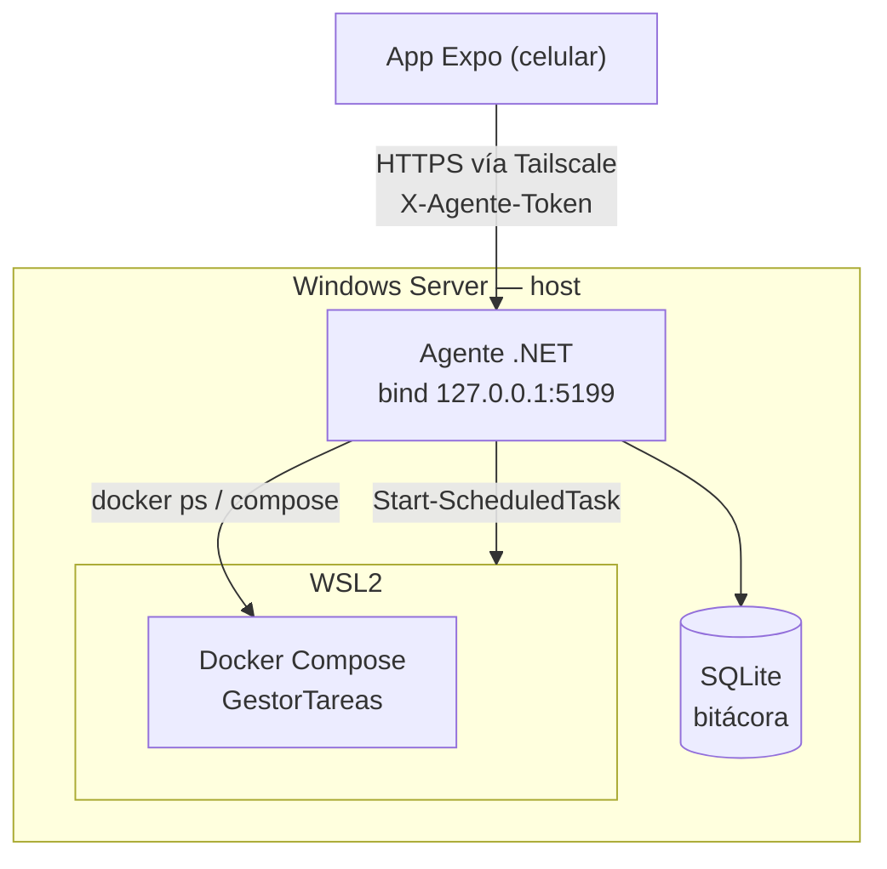

# ***Diagrama de Agente para controlar servidor windows atravez de una apliacion movil***

### Un pequeño agente para controlar wsl y servicioes dentro de este u afuera para mantenimiento y control del servidor via remoto usando tailscale sin necesidad de ssh.